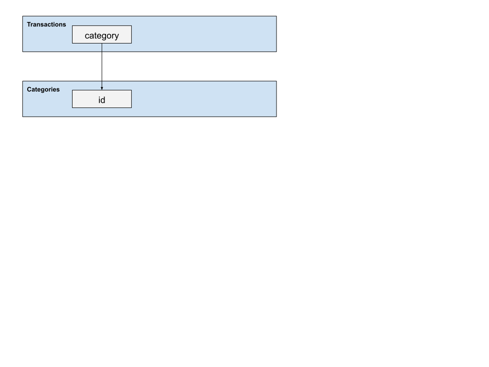

# Budgy Design Notes

## Architecture Overview

**Two-Module System:**

* **budgy.core** - Data processing, database operations, OFX import
* **budgy.gui** - Pygame-based GUI application for data visualization

**Entry Points:**

* `budgy-import` - Command-line tool for importing OFX files.
* `budgy-viewer` - GUI application for viewing and categorizing transactions

**Key Technologies:**

* Python 3.9+ with SQLite database
* pygame_gui for cross-platform GUI
* ofxtools for OFX file processing
* pytest/tox for comprehensive testing

## Recent Enhancements

**Database Migration System:**

* Automatic schema updates on database open
* Handles migration from old (fitid, account) to new (fitid, account, posted) unique constraint
* Preserves existing data during schema changes

**Primary Key Collision Fix:**

* Resolves OFX FITID collision issues where same FITID appears on different dates
* Enables precise transaction identification for category assignment
* Comprehensive test suite validates collision handling

**Cross-Platform Compatibility:**

* Full CI testing on Ubuntu, macOS, Windows
* Platform-specific file handling and path management
* Robust error handling for different environments

# Configuration System

Budgy components should share a config object.

## Classes

* BudgyConfig  
  * Wrapper for Budgy configuration that standardizes usage.  
* BudgyConfigUser \- I DON'T THINK I NEED THIS  
  * All of the logic for including, using a BudgyConfig

**BudgyConfig Implementation:**

* JSON-based configuration storage
* Platform-specific config directories (~/.config/budgy/ on Unix, %APPDATA% on Windows)
* Database path configuration
* Import directory preferences
* Retirement planning target date

**Configuration Features:**

* Automatic config file creation with defaults
* Cross-platform path handling
* Persistent settings storage

# Database Schema

## Tables

### Transactions

| Field | Type | Description |
| :---- | :---- | :---- |
| fitid | text | Financial Transaction ID from OFX (string format) |
| account | string | Account identifier |
| type | string | Transaction type (DEBIT, CREDIT, etc.) |
| posted | string | ISO format timestamp when transaction posted |
| amount | float | Amount of transaction |
| name | string | Text describing payee, etc |
| memo | string  | Description of type of transaction |
| checknum | text | Check number (only for checks) |
| category | int | Link to category ID (defaults to 1) |

**Unique Constraint:** `(fitid, account, posted)` - Handles OFX FITID collisions by including posted date.

### Categories

| Field | Type | Description |
| :---- | :---- | :---- |
| id | int | Primary key (auto-increment) |
| name | string | Main category name |
| subcategory | string | Subcategory name (hierarchical) |
| expense_type | int | 0=non-expense, 1=one-time expense, 2=recurring expense |

**Hierarchical Structure:** Categories use name/subcategory pairs (e.g., "Auto"/"Gas", "Entertainment"/"Coffee")

### Categorization Rules

| Field | Type | Description |
| :---- | :---- | :---- |
| id | int | Primary key (auto-increment) |
| pattern | string | Text pattern to match in transaction names/memos |
| category | string | Category name to assign |
| subcategory | string | Subcategory name to assign |

**Auto-categorization:** Rules automatically assign categories to imported transactions based on text patterns.

## ERD

## Default Categories (Hierarchical Implementation)

**Current Structure:** Categories use name/subcategory pairs with expense_type classification.

### Expense Categories (expense_type = 1 or 2)

**Auto (Recurring - expense_type=2)**
* Auto / Gas
* Auto / Service  
* Auto / Repairs

**Entertainment (Recurring - expense_type=2)**
* Entertainment / Coffee
* Entertainment / Dining
* Entertainment / Movies

**Household (Mixed)**
* Household / Rent (Recurring - expense_type=2)
* Household / Utilities (Recurring - expense_type=2) 
* Household / Repairs (One-time - expense_type=1)

**Insurance (Recurring - expense_type=2)**
* Insurance / Auto
* Insurance / Home
* Insurance / Medical

**Travel (One-time - expense_type=1)**
* Travel / Hotel
* Travel / Transportation

### Income Categories (expense_type = 0)

**Income (Non-expense - expense_type=0)**
* Income / Salary
* Income / Interest
* Income / Dividends

**Internal Transfers (Non-expense - expense_type=0)**
* Transfer / Savings
* Transfer / Investment

### System Categories

* **No Category** (id=1) - Default for uncategorized transactions
* **Expense** (id=2) - Generic expense category

**Notes:** 

* The hierarchical system allows for better organization and reporting
* expense_type enables filtering for different report types
* Auto-categorization rules can target specific name/subcategory combinations