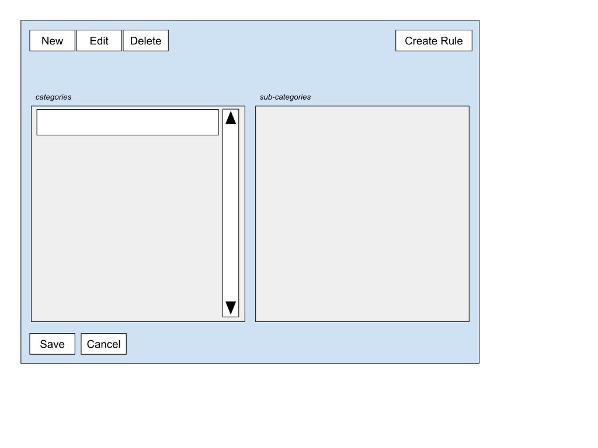

# Budgy UI Design Notes

## Overview

This document provides a comprehensive guide to the budgy-viewer user interface design, including component hierarchy, wireframes, and implementation status. For general architecture and database design, see [Design_Notes.md](Design_Notes.md).

**UI Framework:** pygame_gui with custom themes  
**Main Window:** 1280x960 pixels  
**Architecture:** Hierarchical component structure with event-driven communication

## Table of Contents

### UI Component Design Documentation
<ul>
  <li><a href="ui-design/main-window.md">Main Window (BudgyViewerApp)</a>
    <ul>
      <li><a href="ui-design/top-panel.md">Top Panel</a></li>
      <li><a href="ui-design/function-panel.md">Function Panel</a>
        <ul>
          <li><a href="ui-design/data-panel.md">Data Panel</a>
            <ul>
              <li><a href="ui-design/record-view.md">Record View Panel</a></li>
            </ul>
          </li>
          <li><a href="ui-design/report-panel.md">Report Panel</a></li>
        </ul>
      </li>
      <li><a href="ui-design/message-panel.md">Message Panel</a></li>
    </ul>
  </li>
  <li><a href="ui-design/category-dialog.md">Category Dialog (Modal)</a></li>
  <li><a href="ui-design/utility-components.md">Utility Components</a></li>
</ul>

### UI Implementation Class Documentation
<ul>
  <li><strong>Core Application Classes</strong>
    <ul>
      <li><a href="ui-implementation/BudgyViewerApp.md">BudgyViewerApp</a></li>
      <li><a href="ui-implementation/TopPanel.md">TopPanel</a></li>
      <li><a href="ui-implementation/BudgyFunctionPanel.md">BudgyFunctionPanel</a></li>
      <li><a href="ui-implementation/MessagePanel.md">MessagePanel</a></li>
    </ul>
  </li>
  <li><strong>Functional Sub-Panel Classes</strong>
    <ul>
      <li><a href="ui-implementation/BudgyDataPanel.md">BudgyDataPanel</a></li>
      <li><a href="ui-implementation/BudgyReportPanel.md">BudgyReportPanel</a></li>
      <li><a href="ui-implementation/BudgyFunctionSubPanel.md">BudgyFunctionSubPanel (Base)</a></li>
    </ul>
  </li>
  <li><strong>Data Display Classes</strong>
    <ul>
      <li><a href="ui-implementation/RecordViewPanel.md">RecordViewPanel</a></li>
      <li><a href="ui-implementation/CategoryDialog.md">CategoryDialog</a></li>
      <li><a href="ui-implementation/CategoryButton.md">CategoryButton</a></li>
    </ul>
  </li>
  <li><strong>Base and Utility Classes</strong>
    <ul>
      <li><a href="ui-implementation/DbRecordView.md">DbRecordView</a></li>
      <li><a href="ui-implementation/BgColorPanel.md">BgColorPanel</a></li>
      <li><a href="ui-implementation/utility-classes.md">Utility Classes</a></li>
    </ul>
  </li>
</ul>

## Overall Screen Layout

**Component Hierarchy:**
- **Top Panel** - Database status and function selection dropdown
- **Function Panel** - Container for switchable Data/Report panels
- **Message Panel** - Status messages and progress indication

# Wireframes

## Function Panels

Function Panels are displayed/hidden based on events generated by the **Function Pulldown** in the Top Panel.

### Report Panel Design

**Status:** COMPLETED  
**Purpose:** Monthly expense analysis and budget planning

Displays selected report with category inclusion/exclusion controls.

**Report Format:**
|  | Ave | Jan | Feb | Mar | Apr | May | Jun | Jul | Aug | Sep | Oct | Nov | Dec |
| :---- | :---: | :---: | :---: | :---: | :---: | :---: | :---: | :---: | :---: | :---: | :---: | :---: | :---: | :---: |
| **YYYY** | *nnnnn* | *nnnnn* | *nnnnn* | *nnnnn* | *nnnnn* | *nnnnn* | *nnnnn* | *nnnnn* | *nnnnn* | *nnnnn* | *nnnnn* | *nnnnn* | *nnnnn* |
| **YYYY** | *nnnnn* | *nnnnn* | *nnnnn* | *nnnnn* | *nnnnn* | *nnnnn* | *nnnnn* | *nnnnn* | *nnnnn* | *nnnnn* | *nnnnn* | *nnnnn* | *nnnnn* |
| **OVERALL AVERAGE:** *nnnnn* |  |  |  |  |  |  |  |  |  |  |  |  |  |

**Interactive Features:**
- Click on "average" cell to view all records for that year/month
- Select records to exclude or re-include in calculations

### Data Panel Design

**Status:** COMPLETED  
**Purpose:** Transaction import and management

**Functions:**
* **Import Data** - Button that opens file dialog for OFX files
* **Clear All Data** - Button with confirmation dialog (implemented)
* **View Data** - Scrollable list of transactions with category editing
* **Auto-categorization** - Rules-based category assignment (implemented)

**Transaction Display Fields:**
* **Date** - Posted date from OFX (100px)
* **Amount** - Transaction amount, formatted (100px, right-aligned)
* **Name** - Payee/description from OFX (270px, left-aligned)
* **Memo** - Transaction memo field (400px, left-aligned)
* **Category** - Dropdown for hierarchical category selection (300px)

**Color Coding:**
- **Recurring expenses:** mediumseagreen
- **One-time expenses:** seagreen  
- **Non-expenses:** slategrey

**Implemented Features:**
* Precise transaction identification using (fitid, account, posted)
* Category assignment to specific transactions (handles duplicate FITIDs)
* Real-time category updates in database

### Category Selection / Editing Dialog

**Status:** IN PROGRESS  
**Purpose:** Category management and auto-categorization rule creation

**Size:** 800x800 pixels

**Layout Structure:**
- **Top Panel:** Action buttons (New, Edit, Delete, Create Rule)
- **Middle Panel:** Category and subcategory selection lists
- **Bottom Panel:** Save/Cancel buttons

**Controls:**
- **`New` Button** - Create new category/subcategory
- **`Edit` Button** - Modify existing category
- **`Delete` Button** - Remove category (with safeguards)
- **`Create Rule` Button** - Define auto-categorization patterns
- **Category List Panel** - Main category selection
- **Sub-category List Panel** - Subcategory selection
- **`Save` Button** - Commit changes
- **`Cancel` Button** - Discard changes

## Message Panel Design

**Status:** COMPLETED  
**Purpose:** User feedback and progress indication

**Components:**
* **Progress bar** - Shows progress of long-running operations
* **Status Message** - Shows current operation status
* **Error Messages** - Displays latest error/warning messages

**Layout:** Bottom of window, height = 3 * BUTTON_HEIGHT + 4 * MARGIN

## Implementation Status Legend

- **COMPLETED** - Fully implemented and functional
- **IN PROGRESS** - Partially implemented, missing some features
- **FUTURE** - Planned but not yet implemented

## Design Patterns

**Container/Component Pattern:** Function panels contain specialized sub-panels

**Event-Driven Communication:** Custom pygame events for loose coupling between components

**Color-Coded Data Display:** Visual indicators for different transaction types

**Hierarchical Organization:** Nested component structure reflects UI layout

## Future Enhancements

- Enhanced auto-categorization rule interface
- Advanced reporting and data export features  
- Configuration panel for user preferences
- Improved data visualization and charting